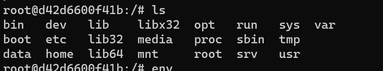

- docker hub

```
https://hub.docker.com/
```

- pulls the images from the repositiory to local environment

```
docker pull
```

eg. docker pull python

- Basically combines docker pool and start , pulls the image is it's not locally available and then starts it right away.

```
docker run
```

```
docker start
docker stop
```

- docker start - restart the container and stop the container

```
docker run -d
```

docker run -d : Run container in detached mode

```
docker run -p
```

docker run -p : minus p allows you to bind port of your host to the container

eg: docker -p6000:6793
here 6000 is your host and 6793 is the host of container

```
docker ps -a
```

- Which basically gives you all the containers no matter if they're running currently or not

```
docker images

```

- docker images : which gives you list of images

```
 docker exec -it d42d6600f41b /bin/bash
```

- d42d6600f41b is the id of running container (it's id of redis )

```
cd /data

cd pwd

cd /

ls
```

- Result :
  
